# How to use `googleapiFind.py`

## Step 1: Get a free trial of the Google Maps Places API
- Step 1: Go to [https://console.cloud.google.com/apis/library/places-backend.googleapis.com](https://console.cloud.google.com/apis/library/places-backend.googleapis.com)
- Step 2: Click `ENABLE`
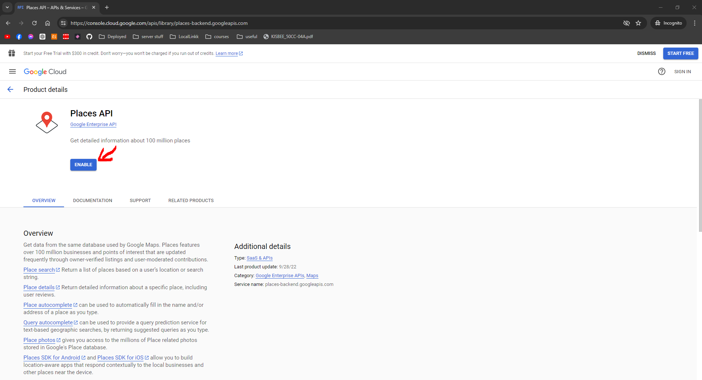

- Step 3: Log in too a google account

- Step 4: Create a Project
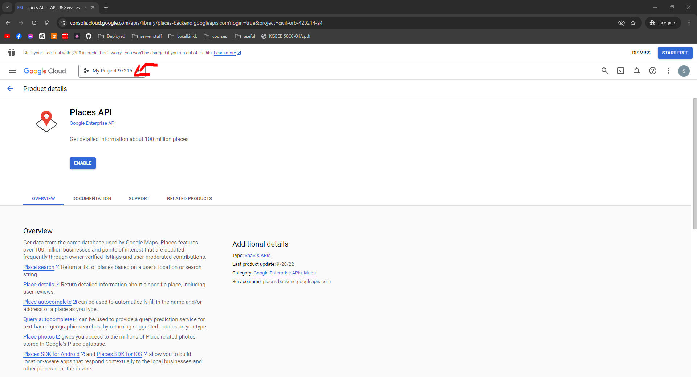
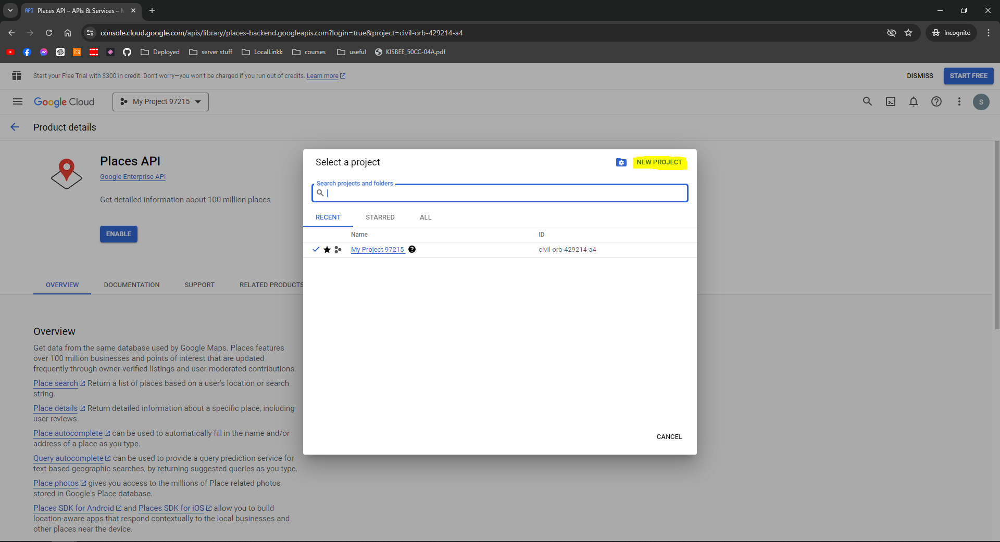
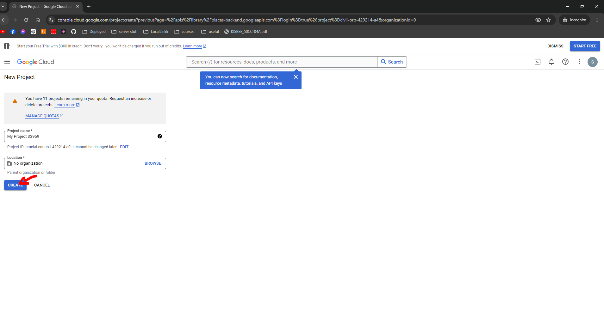

- Step 5: Enable The API
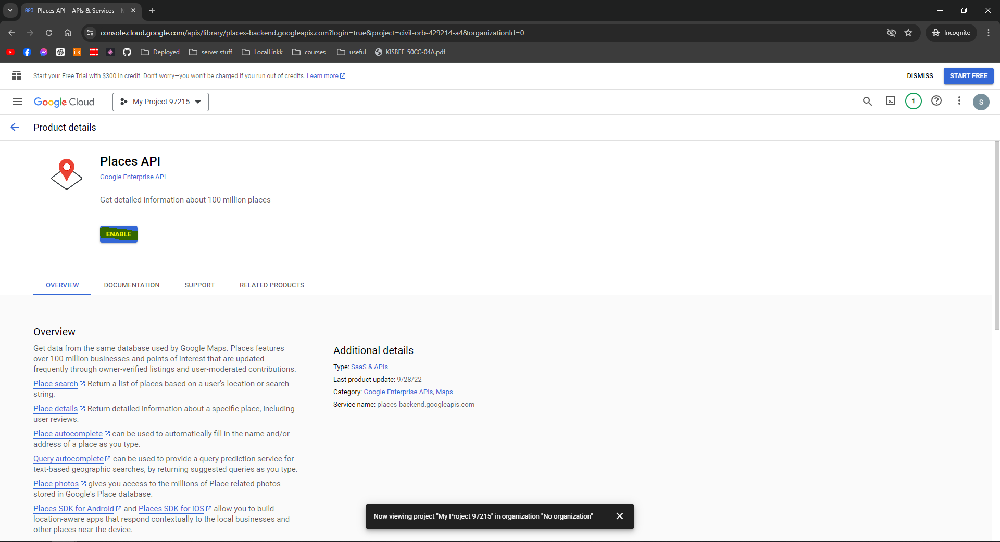
Agree to what its asking

- Step 6: Add your details, Im pretty sure it doesn't charge you

- Step 7: Find your api key:
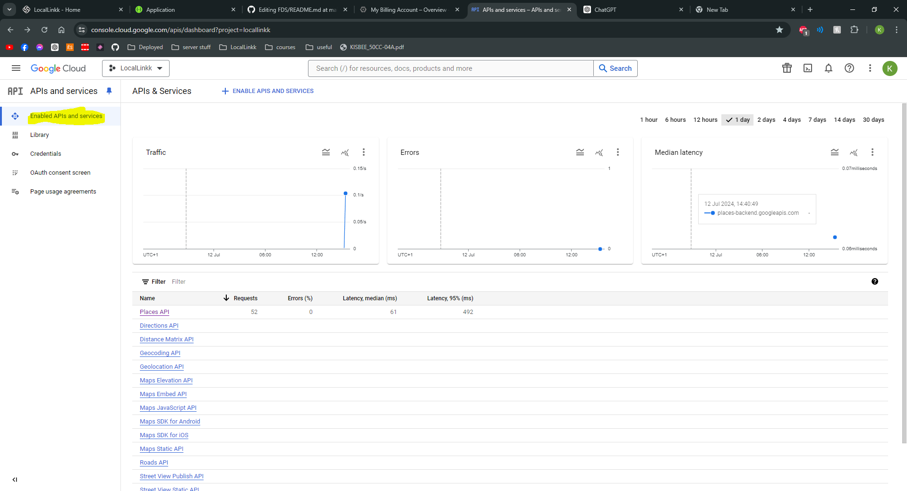
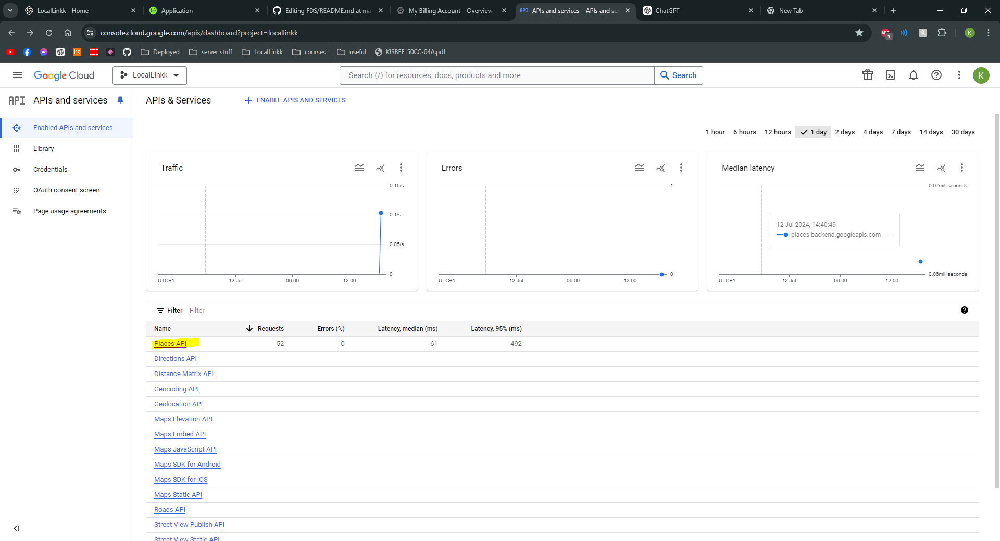
Scroll down to Places API and click `keys`
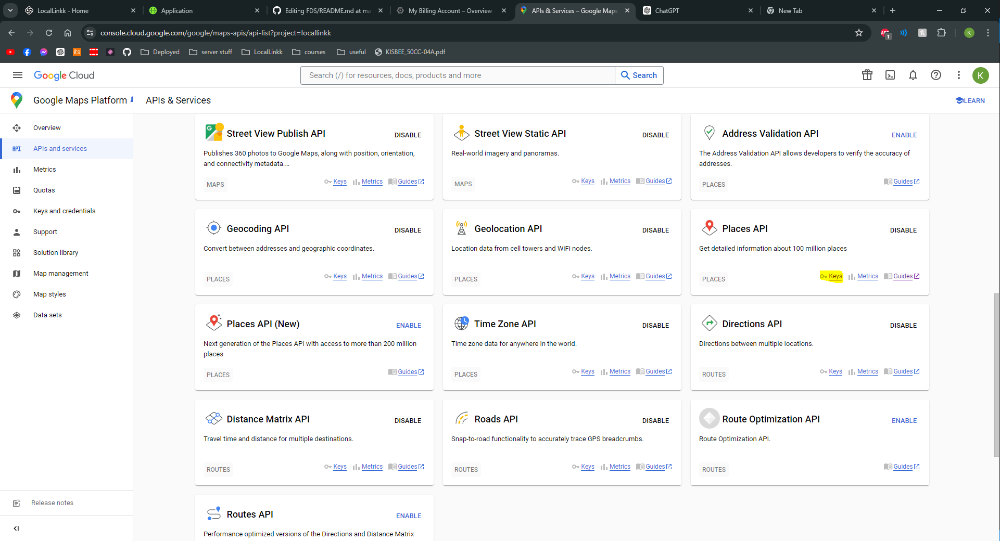
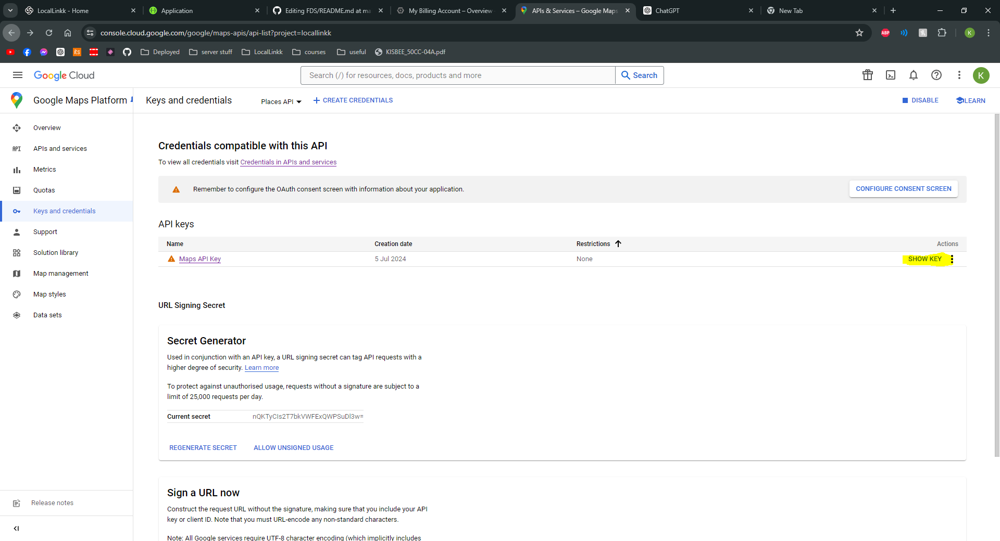
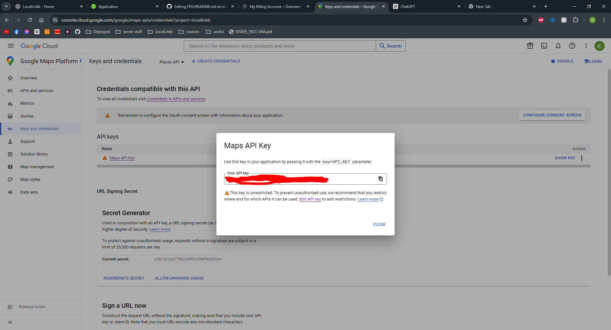

## Step 2: The code
- Take Your api key and put it on line `8` of `googleapiFind.py`
```python
API_KEY = 'YOUR_API_KEY'
```

- Enter a directory path where you want the spreadsheets to be stored on line `53` of `googleapiFind.py`
```python
# Directory to save the companies
# MARK: CHANGE
COMPANY_DIR = 'YOUR_DIRECTORY_PATH'
```

- Change The number of companies wanted per category in like `112` of `googleapiFind.py`
- Currently 5
```python
# MARK: CHANGE
# change to the amount of companies you want to search per category
companies = companies[:5]
```

## Step 4: Optional Changes  
- You can add or remove catagories but just changing the list, keep the list headers the same tho.

- You can change the Location its searching by changing the lat and lng on lines `150 and 151` of `googleapiFind.py`

```python
# MARK: CHANGE
# change the latitude and longitude to the location you want to search, currently set to Macclesfield, Uk
latitude = 53.2606635
longitude = -2.1255158
```

## Step 5: Run the code and get companies:
- The code should run and create spreadsheets with company data in if all done correctly (Hopefully)
- The spreadsheets should look like this:
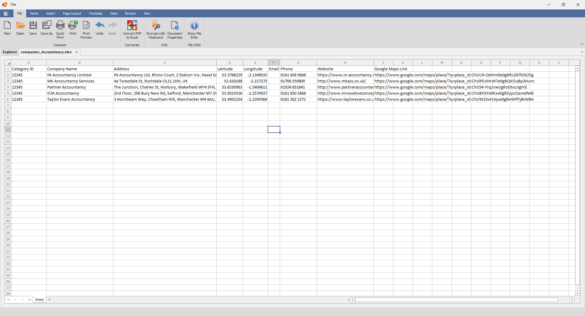

## Ive not been changed doing this but im not 100% sure so be careful
- my billing statement for 1000 companies:
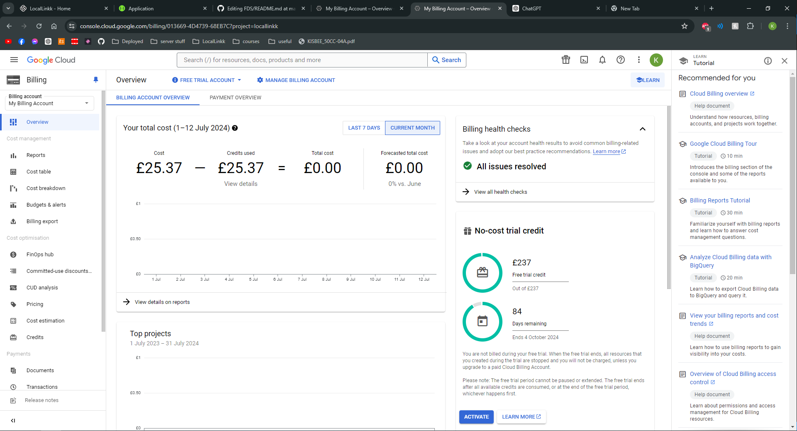
